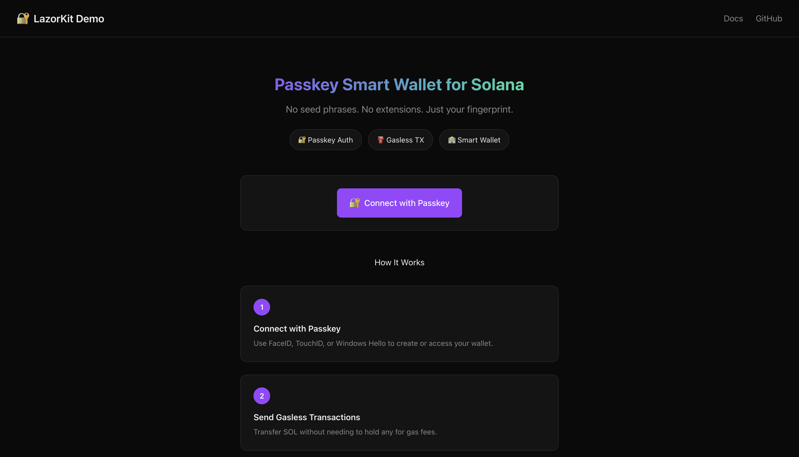
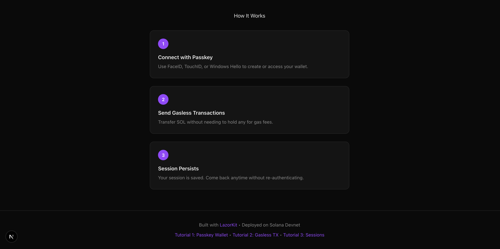

# 🔐 LazorKit Passkey Gasless Demo

> **The future of Solana UX: No seed phrases. No browser extensions. Just your fingerprint.**

[](https://vercel.com/new/clone?repository-url=https://github.com/AJ-EN/lazorkit-passkey-gasless-demo)
[](https://opensource.org/licenses/MIT)
[](https://nextjs.org/)
[](https://lazorkit.com)

A production-ready starter template demonstrating **passkey authentication** and **gasless transactions** on Solana using the [LazorKit SDK](https://lazorkit.com). Perfect for developers looking to build Web3 apps with Web2-like UX.

---

## 📸 Demo Preview

| Connect with Passkey | Send Tokens (Gasless) |
|:---:|:---:|
|  |  |

---

## ✨ Features

| Feature | Description |
|---------|-------------|
| 🔐 **Passkey Authentication** | Create and access wallets using FaceID, TouchID, or Windows Hello |
| ⛽ **Gasless Transactions** | Send SOL and USDC without needing native tokens for gas fees |
| 💰 **SPL Token Support** | Full USDC transfer with automatic Associated Token Account creation |
| 🧠 **Smart Wallet** | Programmable account abstraction via Program Derived Addresses (PDAs) |
| 💾 **Session Persistence** | Stay connected across page refreshes and browser sessions |
| 🎨 **Modern UI** | Solana-themed dark mode design with responsive layout |

---

## 🚀 Quick Start

### Prerequisites

- Node.js 18+ 
- A device with biometrics (TouchID, FaceID, or Windows Hello)
- Modern browser (Chrome 67+, Safari 13+, Firefox 60+)

### 1. Clone & Install

```bash
git clone https://github.com/AJ-EN/lazorkit-passkey-gasless-demo.git
cd lazorkit-passkey-gasless-demo
npm install
```

### 2. Configure Environment (Optional)

```bash
cp .env.example .env.local
```

### 3. Run Development Server

```bash
npm run dev
```

### 4. Open in Browser

Navigate to [http://localhost:3000](http://localhost:3000) and click **"Connect with Passkey"**

---

## 📦 Dependencies

| Package | Purpose |
|---------|---------|
| `@lazorkit/wallet` | Core SDK — Provider, hooks, and Paymaster integration |
| `@solana/web3.js` | Solana transactions and PublicKey utilities |
| `@solana/spl-token` | SPL Token program for USDC transfers |
| `@coral-xyz/anchor` | Peer dependency for Solana program interactions |
| `buffer` | Polyfill for Next.js browser compatibility |
| `zustand` | State management (peer dependency) |

---

## 📁 Project Structure

```
lazorkit-passkey-gasless-demo/
├── src/
│   ├── app/
│   │   ├── providers.tsx    # LazorkitProvider setup + Buffer polyfill
│   │   ├── layout.tsx       # Root layout with Providers wrapper
│   │   ├── page.tsx         # Main demo page
│   │   └── globals.css      # Solana-themed styling
│   ├── components/
│   │   ├── connect-wallet.tsx   # Passkey wallet connect/disconnect
│   │   ├── send-tokens.tsx      # SOL & USDC transfer with gasless TX
│   │   └── sign-message.tsx     # Message signing (advanced)
│   ├── hooks/
│   │   └── useTypedWallet.ts   # Type-safe wrapper for LazorKit SDK
│   └── images/
│       └── *.png               # Demo screenshots
├── docs/
│   ├── 01-passkey-wallet-creation.md   # Tutorial 1
│   ├── 02-gasless-transactions.md      # Tutorial 2
│   └── 03-session-persistence.md       # Tutorial 3
├── .env.example                # Environment variables template
├── README.md
└── package.json
```

---

## 🔧 Configuration

The SDK uses environment variables for configuration:

| Variable | Description | Default |
|----------|-------------|---------|
| `NEXT_PUBLIC_SOLANA_RPC` | Solana RPC endpoint | `https://api.devnet.solana.com` |
| `NEXT_PUBLIC_LAZORKIT_PORTAL` | LazorKit passkey portal | `https://portal.lazor.sh` |
| `NEXT_PUBLIC_LAZORKIT_PAYMASTER` | Kora paymaster URL | `https://kora.devnet.lazorkit.com` |

### Switching to Mainnet

Update your `.env.local`:

```env
NEXT_PUBLIC_SOLANA_RPC=https://api.mainnet-beta.solana.com
NEXT_PUBLIC_LAZORKIT_PAYMASTER=https://kora.mainnet.lazorkit.com
```

---

## 📚 Tutorials

Step-by-step guides to understanding the implementation:

| Tutorial | Description |
|----------|-------------|
| [1. Passkey Wallet Creation](docs/01-passkey-wallet-creation.md) | How WebAuthn passkeys replace seed phrases |
| [2. Gasless Transactions](docs/02-gasless-transactions.md) | How the Paymaster covers gas fees |
| [3. Session Persistence](docs/03-session-persistence.md) | How sessions work across refreshes and devices |

---

## 🧪 Testing

### Airdrop Devnet SOL

Your smart wallet needs SOL to test transfers:

```bash
solana airdrop 1 YOUR_SMART_WALLET_ADDRESS --url devnet
```

Or use the [Solana Faucet](https://faucet.solana.com/).

### Get Devnet USDC

For testing USDC transfers, use the [Circle Devnet Faucet](https://faucet.circle.com/).

### Manual Testing Checklist

- [ ] Create new passkey wallet (first-time user)
- [ ] Restore session on page refresh
- [ ] Send 0.001 SOL to another address
- [ ] Send USDC to another address
- [ ] View transaction on Solana Explorer
- [ ] Sign an arbitrary message
- [ ] Disconnect and reconnect

---

## 🌐 Deployment

### Deploy to Vercel (Recommended)

[](https://vercel.com/new/clone?repository-url=https://github.com/AJ-EN/lazorkit-passkey-gasless-demo)

### Manual Deployment

```bash
npm run build
npm run start
```

---

## 🔧 Troubleshooting

### "Passkey creation failed"

**Solution:** Ensure your device has biometrics enabled (TouchID, FaceID, or Windows Hello). Passkeys require a secure context — use `https://` or `localhost`.

### "Transaction failed" when sending USDC

**Solution:** Make sure your smart wallet has Devnet USDC. Get test USDC from the [Circle Devnet Faucet](https://faucet.circle.com/).

### "Buffer is not defined"

**Solution:** The app includes a Buffer polyfill in `providers.tsx`. If you see this error, ensure you're importing the providers correctly in your layout.

### Wallet not connecting on mobile

**Solution:** Some mobile browsers have limited WebAuthn support. Try Safari on iOS or Chrome on Android.

### "User cancelled the operation"

**Solution:** This is normal — user dismissed the passkey dialog. Just prompt them to try again.

---

## 💡 Use Cases

This template demonstrates:

- ✅ **Passkey login flow** with smart wallet
- ✅ **Gasless SOL transfer** on Solana Devnet
- ✅ **Gasless USDC transfer** with automatic ATA creation
- ✅ **Message signing** for authentication flows

**Extend it to build:**

- "Pay with Solana" payment widgets
- NFT minting without gas fees
- Token swap interfaces
- Subscription services with automated billing

---

## 🔗 Resources

- [LazorKit Documentation](https://docs.lazorkit.com/)
- [LazorKit GitHub](https://github.com/lazor-kit/lazor-kit)
- [LazorKit Telegram](https://t.me/lazorkit)
- [Solana Developer Docs](https://solana.com/docs)

---

## 📄 License

MIT License — feel free to use this template for your own projects!

---

## 🙏 Acknowledgments

Built with [LazorKit](https://lazorkit.com) — the open-source passkey wallet infrastructure for Solana.

---

<p align="center">
  <strong>⭐ Star this repo if you find it helpful!</strong>
</p>
